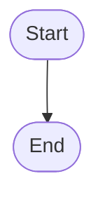

Start([Start]) --> Generate_Temperature([Generate Random Temperature])
    Generate_Temperature --> Get_User_Guess([Get User Guess])
    Get_User_Guess --> Validate_Input([Validate User Input])
    Validate_Input -->|Invalid Input|> Error_Message([Error Message])
    Validate_Input -->|Valid Input|> Compare_Guess([Compare Guess to Temperature])
    Compare_Guess -->|Too High|> Too_High_Feedback([Too High Feedback])
    Compare_Guess -->|Too Low|> Too_Low_Feedback([Too Low Feedback])
    Compare_Guess -->|Correct|> Correct_Feedback([Correct Feedback])
    Too_High_Feedback --> Get_User_Guess
    Too_Low_Feedback --> Get_User_Guess
    Correct_Feedback --> End([End])
The game begins by prompting the user to guess a randomly generated temperature between 0°C and 40°C. After the user inputs their guess, it is validated for correctness; invalid inputs trigger an error message and a prompt to try again. The user's guess is then compared to the generated temperature, providing feedback if it’s too high, too low, or correct. Upon a correct guess, the user is congratulated, and the game concludes, inviting them to play again.
